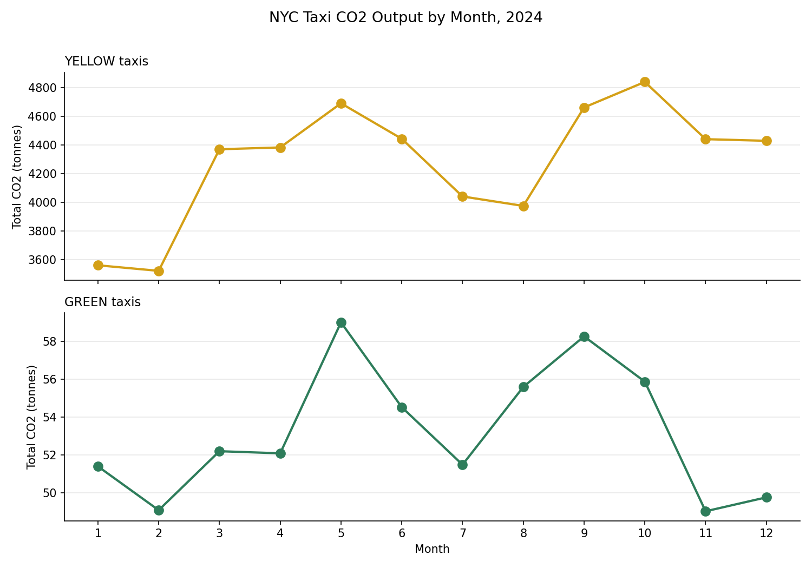

# DS3022 Data Project 1 — NYC Taxi CO2 Pipeline

A four-stage data pipeline that loads every 2024 NYC yellow and green taxi trip
into DuckDB, cleans it, calculates the CO2 output of each trip, and reports
which hours, days, weeks and months produce the most carbon.

The full pipeline runs in about 19 seconds on roughly 41.8 million raw trips.

## What the pipeline does

| Stage | Script | What it does |
|---|---|---|
| Load | `load.py` | Downloads the 24 monthly Parquet files (12 yellow + 12 green) from the NYC TLC site, caches them locally, and builds three DuckDB tables. Prints raw row counts before any cleaning. |
| Clean | `clean.py` | Applies five cleaning rules, running a verification query after each one to prove the condition is gone. |
| Transform | `transform.py` | Adds six calculated columns, including a CO2 figure looked up live from `vehicle_emissions`. |
| Analyse | `analysis.py` | Answers the five analysis questions for each cab type and renders the CO2-by-month plot. |

Everything is written to a local DuckDB database, `emissions.duckdb`.

### Tables

- **`yellow_trips`** — all 2024 yellow taxi trips
- **`green_trips`** — all 2024 green taxi trips
- **`vehicle_emissions`** — the 8-row CO2 lookup table from `data/vehicle_emissions.csv`

### Cleaning rules

1. Duplicate trips removed
2. Trips with 0 passengers removed
3. Trips of 0 miles removed
4. Trips longer than 100 miles removed
5. Trips lasting more than 1 day (86,400 seconds) removed

| Table | Raw rows | After cleaning | Removed |
|---|---|---|---|
| `yellow_trips` | 41,169,720 | 39,436,780 | 1,732,940 |
| `green_trips` | 660,218 | 617,806 | 42,412 |

### Calculated columns

| Column | Calculation |
|---|---|
| `trip_co2_kgs` | `trip_distance` x `co2_grams_per_mile` / 1000, rate looked up from `vehicle_emissions` |
| `avg_mph` | `trip_distance` / (duration in seconds / 3600) |
| `hour_of_day` | `date_part('hour', pickup_time)` |
| `day_of_week` | `date_part('dow', pickup_time)` — 0 = Sunday through 6 = Saturday |
| `week_of_year` | `date_part('week', pickup_time)` |
| `month_of_year` | `date_part('month', pickup_time)` |

## How to run it

```bash
pip install -r requirements.txt
python run.py
```

`run.py` chains all four stages in order and stops if any stage fails. The first
run downloads about 683MB of Parquet files; later runs reuse the cached copies.

Stages can also be run individually, in this order:

```bash
python load.py
python clean.py
python transform.py
python analysis.py
```

### Outputs

- `emissions.duckdb` — the database (not committed)
- `co2_by_month_2024.png` — the CO2-by-month plot
- `load.log`, `clean.log`, `transform.log`, `analysis.log`, `run.log` — one log per stage (not committed)

## Project structure

```
load.py           Stage 1: download and load
clean.py          Stage 2: five cleaning rules
transform.py      Stage 3: six calculated columns
analysis.py       Stage 4: analysis and plot
run.py            Runs all four stages with one command
requirements.txt  duckdb, pandas, dbt-duckdb, matplotlib
data/
  vehicle_emissions.csv   CO2 rate lookup
  parquet/                Cached Parquet downloads (gitignored)
```

## Design decisions

**Two trip tables instead of one.** Yellow and green publish the same trip data
under different column names (`tpep_pickup_datetime` vs `lpep_pickup_datetime`).
Rather than fight that, `load.py` aliases both to a shared `pickup_time` /
`dropoff_time` on the way in, so `clean.py` and `transform.py` can treat the two
tables identically. Keeping them separate also means each one carries its own
emissions rate without needing an extra column.

**Only 5 of the 40 available columns are kept.** The source files carry 20
columns each — fares, taxes, tips, surcharges, location IDs. None of them are
used by any cleaning rule or any of the six calculations, so they are dropped at
load time. The kept columns are `VendorID`, `pickup_time`, `dropoff_time`,
`passenger_count` and `trip_distance`.

**Parquet files are cached to disk.** `load.py` downloads each monthly file once
into `data/parquet/` and loads from disk afterwards. Reading the 24 files
straight from the remote URL on every run meant re-downloading about 683MB each
time, which was slow and eventually got the requests rate-limited. Downloads go
to a `.part` file first and are renamed only on success, so an interrupted run
cannot leave a truncated file that a later run mistakes for a complete one.

**Every file is downloaded before any table is replaced.** A failed download
partway through would otherwise leave a table holding only part of the year.

**Duplicates are removed with `SELECT DISTINCT *`.** This data has no per-trip
identifier, so two rows matching on every column genuinely are the same trip.
A window function partitioned on a business key would be needed if the table had
an ID column, but here `DISTINCT *` is both correct and simpler.

**Cleaning runs before transforming.** Deduplication happens first so that the
remaining four rules report their counts against a table that already holds one
copy of each trip.

**CO2 is looked up, never hard-coded.** `transform.py` reads
`co2_grams_per_mile` from `vehicle_emissions` at run time — 380 g/mi for yellow
and 350 g/mi for green. Hard-coding a single rate would silently apply yellow's
figure to green trips and overstate green's emissions by about 8.6%.

**`run.py` launches each stage as a separate process.** `logging.basicConfig`
only takes effect once per process, so importing all four modules into one
process would send every stage's output into `load.log` and collapse the
separate per-stage log files. Running each script as its own process keeps the
logs separate and makes each stage behave exactly as it does standalone.

## Results

Largest single carbon-producing trip of 2024:

- **Yellow:** 37.95 kg (99.86 miles, picked up 2024-10-27 01:28:18)
- **Green:** 34.75 kg (99.28 miles, picked up 2024-02-28 11:11:12)

Average CO2 per trip, heaviest and lightest:

| Grouping | Yellow heaviest | Yellow lightest | Green heaviest | Green lightest |
|---|---|---|---|---|
| Hour of day | 5 (2.320 kg) | 18 (1.142 kg) | 5 (1.597 kg) | 18 (0.918 kg) |
| Day of week | Sunday (1.462 kg) | Saturday (1.219 kg) | Sunday (1.121 kg) | Tuesday (1.004 kg) |
| Week of year | 35 (1.474 kg) | 51 (1.170 kg) | 35 (1.394 kg) | 3 (0.944 kg) |
| Month of year | August (1.396 kg) | February (1.226 kg) | August (1.147 kg) | January (0.969 kg) |

Both cab types peak at 5am and bottom out at 6pm, which fits the shape of the
data: early-morning trips run long distances on empty roads, while rush-hour
trips are short and slow. The largest trips for both colours land just under 100
miles, exactly where the cleaning cutoff puts the ceiling.

The plot below shows something different from the table above it. The table
reports the **average** CO2 of a single trip, which is heaviest in August for
both colours. The plot reports the **total** CO2 emitted across every trip in
the month, which depends on how many trips ran as well as how large each one
was. On that measure yellow peaks in October (4,839 t) against a February low
of 3,522 t, while green peaks in May (59 t) against a November low of 49 t.

Green emits roughly 1.2% of yellow's CO2 in every month, so the two series are
drawn in stacked panels with their own y-axes. On a shared axis the green line
flattens against zero and its seasonal shape disappears entirely.



## Notes

- `avg_mph` is infinite for roughly 12,600 trips whose recorded pickup and
  dropoff times are identical. The assignment's cleaning rules only remove trips
  *longer* than 86,400 seconds, so zero-duration trips survive. This does not
  affect any of the reported figures, none of which use `avg_mph`.
- Transformations are done with python-based DuckDB commands. DBT was not used,
  so the `dbt/` directory is left as it came in the starter repo.
- Parquet files, logs and the DuckDB database are all excluded by `.gitignore`.
